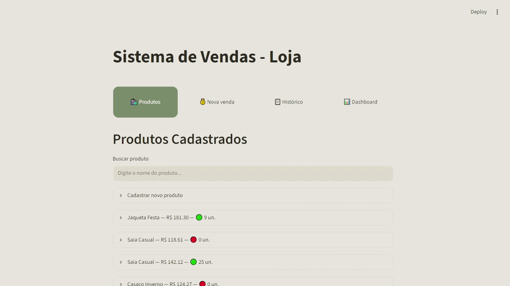

# 🛒 store-management-system

Sistema de gestão para pequenos comércios desenvolvido em Python com foco em simplicidade, organização e facilidade de uso.

## 📖 Sobre

O store-management-system é uma aplicação criada para auxiliar pequenos negócios no controle diário de produtos, estoque e vendas.

A proposta é oferecer uma interface simples, permitindo que comerciantes registrem informações importantes sem complicação.

> **Este projeto representa uma demonstração funcional e pode ser adaptado às necessidades de cada empresa.**

---

## ✨ Funcionalidades

- 📦 Cadastro de produtos
- ✏️ Edição de produtos
- 🗑️ Exclusão de produtos
- 📊 Controle de estoque
- 💰 Registro de vendas
- 📜 Histórico de vendas
- 📈 Dashboard com indicadores
- 💾 Banco de dados SQLite

---

## 🛠️ Tecnologias utilizadas

- Python
- Streamlit
- SQLite
- Pandas
- Plotly

---

## 📷 Demonstração



---

## 🚀 Como executar

Clone o repositório

```bash
git clone https://github.com/robertob-data/store-management-system.git
```

Entre na pasta

```bash
cd store-management-system
```

Instale as dependências

```bash
pip install -r requirements.txt
```

Execute o projeto

```bash
streamlit run app.py
```

---

## 📁 Estrutura

```
store-management-system/

│

├── app.py

├── database.py

├── produtos.py

├── vendas.py

├── loja.db

├── requirements.txt

└── README.md
```

---

## 🎯 Objetivo

Este projeto foi desenvolvido para demonstrar conhecimentos em:

- Desenvolvimento com Python
- CRUD
- Banco de Dados
- Streamlit
- Organização de código
- Estruturação de aplicações
- Boas práticas de desenvolvimento

---

## 📌 Futuras melhorias

- Login de usuários
- Controle de permissões
- Emissão de comprovantes
- Cadastro de clientes
- Relatórios avançados
- Backup automático
- Hospedagem em nuvem

---

## 👨‍💻 Autor

**Roberto Dias**

Python Developer

📷 Instagram: **@robertob.dev**

GitHub:
https://github.com/robertob-data# 🛒 store-management-system
